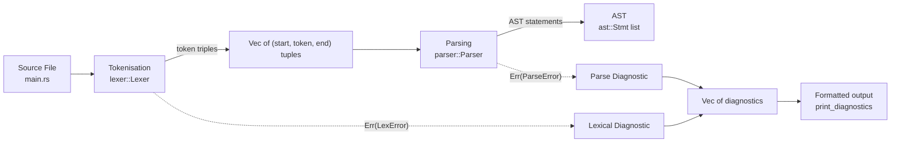
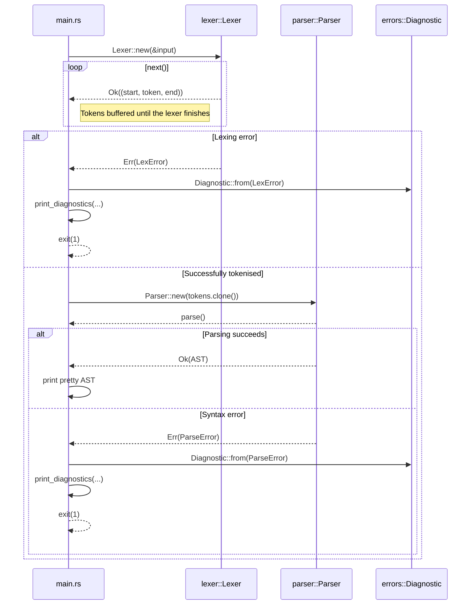
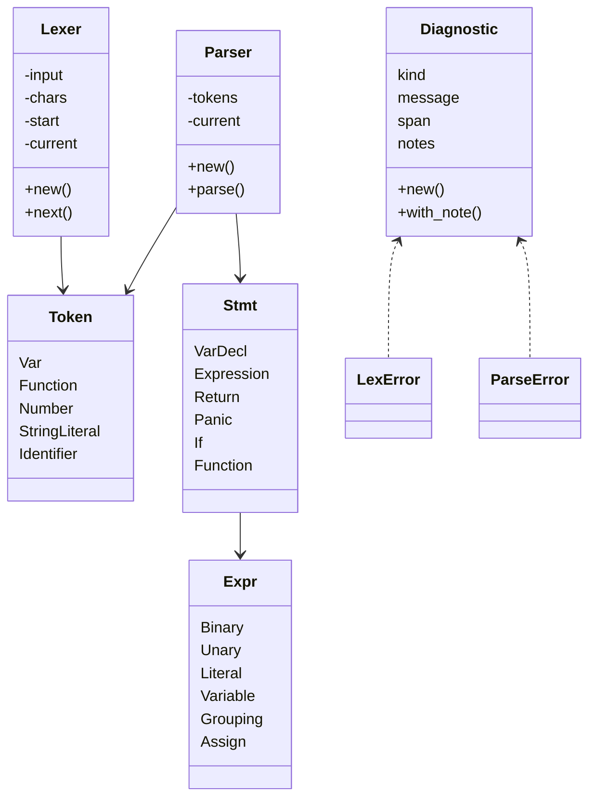
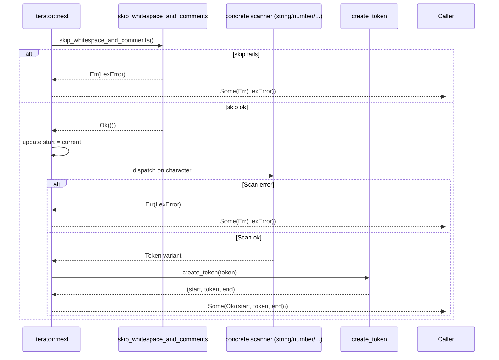
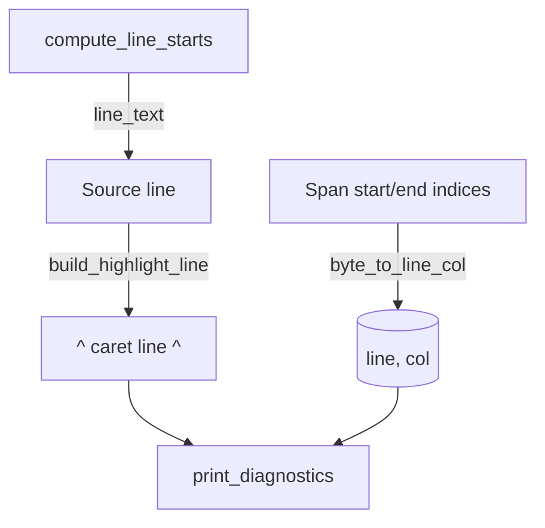
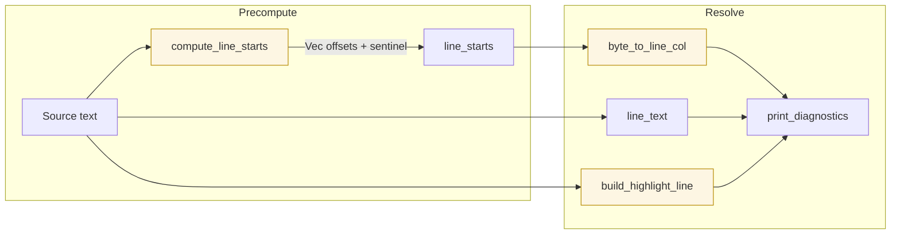
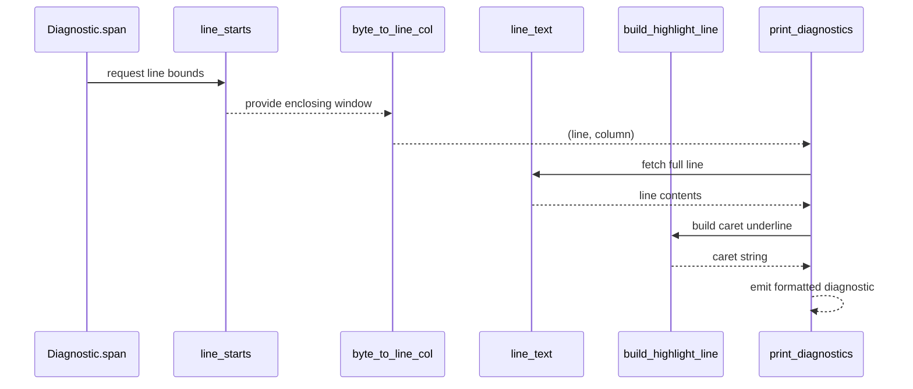

# Blazelint Pipeline Overview

This document describes how the current implementation of Blazelint turns raw Ballerina source code into tokens, builds an Abstract Syntax Tree (AST), and surfaces diagnostics. Diagrams are rendered with Mermaid to make each stage easier to grasp.

## 👀 High-Level Data Flow



* `main.rs` coordinates the run: it loads the file, launches the lexer, hands the resulting tokens to the parser, and prints either the AST or any collected diagnostics.
* Every stage is fallible. Errors stay rich with byte spans so the front-end can offer precise highlights.

## 🔁 Runtime Interaction



The CLI intentionally clones the token list: one copy feeds the parser, the other is printed to help users debug lexer output.

## 🧱 Structural Overview



## 🧭 Module-by-Module Tour

### `main.rs`
* Reads file paths from the CLI and loads the source into memory.
* Builds `line_starts` so byte spans can be mapped back to `(line, column)` pairs.
* Runs the lexer as an iterator, gathering either tokens or `LexError`s. All errors are converted into `Diagnostic` values immediately.
* Emits tokens for debugging before invoking the parser.
* Creates a `Parser`, calls `parse()`, and prints the resulting `Vec<Stmt>` using Rust’s pretty debug formatter.
* On any diagnostic, calls `print_diagnostics`, which:
  * Maps byte spans to line/column positions.
  * Prints the offending line (with a caret underline built by `build_highlight_line`).
  * Appends any `note` entries supplied by the lexer or parser.

### `lexer.rs`
* `Lexer<'input>` holds the input string, a peekable iterator, and bookkeeping fields (`start`, `current`).
* Implements `Iterator`. Each call to `next()`:
  1. Skips whitespace and comments (`skip_whitespace_and_comments`), reporting unterminated block comments immediately.
  2. Marks the new `start` offset and advances over the next token.
  3. Delegates to helpers for strings, numbers, identifiers, or punctuation, returning `(start, token, end)` tuples.
  4. Emits `LexError` for malformed constructs (e.g., stray `&`, unterminated strings, malformed exponents).
* Keyword recognition happens in `identifier()`, which upgrades raw identifiers to reserved tokens (`Token::Function`, `Token::Return`, etc.).

#### Lexer function-by-function walkthrough

```mermaid
flowchart TD
    A[Lexer::new] --> B[Iterator::next]
    B --> C[skip_whitespace_and_comments]
    C --> D{terminator?}
    D -- yes --> Done[Return None]
    D -- no --> E[advance]
    E --> F{character class}
    F -->|quote| G[string]
    F -->|digit| H[number]
    F -->|alpha/_| I[identifier]
    F -->|operator| J[create_token]
    F -->|unexpected| K[LexError]
    G & H & I --> L[create_token]
    L --> M[Ok((start, token, end))]
    K --> N[Err(LexError)]
    M & N --> B
```

| Function | Role | Return type | Notes |
| --- | --- | --- | --- |
| `Lexer::new(input)` | Seeds the scanner with an `&str`, a `Peekable<Chars>` iterator, and zeroed offsets. | `Lexer<'_>` | Keeps a **borrow** to avoid copying the input. |
| `Iterator::next()` | Orchestrates one scanning step and yields the next token triple or error. | `Option<Result<(usize, Token, usize), LexError>>` | `None` marks EOF; `Some(Ok(...))` carries a token; `Some(Err(...))` surfaces a lexing failure. |
| `skip_whitespace_and_comments()` | Consumes spaces, newlines, and comments before scanning a token. | `Result<(), LexError>` | Returns `Ok(())` when skipping succeeds, or `Err` when it hits an unterminated block comment. |
| `create_token(token_type)` | Packages the current lexeme as `(start, token, end)`. | `(usize, Token, usize)` | Uses the `start` and `current` offsets maintained by the lexer. |
| `string()` | Reads characters until the closing quote, handling escape sequences. | `Result<Token, LexError>` | Returns `Token::StringLiteral` or an error like “Unterminated string literal.” |
| `number()` | Parses integer/float/exponent forms. | `Result<Token, LexError>` | Relies on `advance()` / `peek()` and reports malformed exponents. |
| `identifier()` | Collects alphanumeric/underscore sequences and upgrades keywords. | `Token` | Returns either a keyword variant (`Token::Return`) or `Token::Identifier(name)`. |
| `advance()` | Pops the next `char` from the iterator and increments `current`. | `Option<char>` | This is the only place the real iterator is consumed. |
| `peek()` | Looks at the next character without consuming it. | `Option<&char>` | Wraps `Peekable::peek()`. |
| `peek_next()` | Looks two characters ahead. | `Option<char>` | Clones the iterator, calls `.next()` twice on the clone, leaving the original untouched. |
| `match_char(expected)` | Consumes the next character only if it matches `expected`. | `bool` | Enables two-character operators like `!=` and `<=`. |
| `is_at_end()` | Tests whether there are any more characters. | `bool` | Simply checks if `peek()` returned `None`. |

##### Understanding the `Result`/`Option` layering

* `skip_whitespace_and_comments` returns `Result<(), LexError>` because skipping can fail (unterminated block comment). Returning `Ok(())` means “skip succeeded, keep scanning in `next()`.”
* The iterator itself yields `Option<Result<...>>`. The outer `Option` is standard Rust iterator semantics (`None` == EOF). The inner `Result` either wraps a successfully created token triple (`Ok`) or a `LexError` (`Err`).
* When a helper like `string()` or `number()` encounters malformed input, it returns `Err(LexError)`; `Iterator::next()` immediately wraps that in `Some(Err(...))` so callers see the failure and can surface a diagnostic without panicking.



### `parser.rs`
* `Parser` stores the token triplets and a cursor index.
* `parse()` repeatedly calls `declaration()` until `is_at_end()` finds no tokens left.
* `declaration()` dispatches on the next token: `var` declarations, `function` definitions, or generic statements.
* Statement parsing covers `if`/`else`, `return`, `panic`, and expression statements. Blocks recursively call `declaration()` until a matching `}` is consumed.
* Expression parsing follows classic recursive descent with precedence-climbing helpers (`logic_or`, `logic_and`, `equality`, `comparison`, `term`, `factor`, `unary`, `primary`).
* Assignment produces `Expr::Assign` nodes when the left-hand side is a plain identifier; otherwise it returns a `ParseError` with an expectation hint, which becomes a diagnostic note (`expected: identifier`).
* Errors such as missing semicolons or braces use `consume()` and the various `error_*` helpers to attach precise spans and expectations.

### `ast.rs`
* Defines the shape of the syntax tree that the parser builds.
* `Expr` variants cover literals, unary/binary operations, variables, assignments, and groupings.
* `Stmt` variants represent top-level constructs: variable declarations, expression statements, return/panic statements, `if` branches, and full function declarations.
* The AST is currently a light-weight data structure used primarily for debugging prints, but it establishes the schema for future linting passes.

### `errors.rs`
* Provides shared diagnostic types.
* `LexError` and `ParseError` carry messages plus the byte `Span` that triggered them (and optional expectation hints for the parser).
* `DiagnosticKind` distinguishes lexical vs. syntactic issues.
* `Diagnostic::from(LexError)` and `Diagnostic::from(ParseError)` adapt stage-specific errors into the uniform reporting surface that `main.rs` prints.

## 🧪 Diagnostics Rendering Details



* `compute_line_starts` emits a monotonically increasing list of byte offsets; a sentinel marks EOF so diagnostics on zero-width spans still map safely.
* `byte_to_line_col` walks that table to convert byte ranges into human-friendly coordinates.
* `line_text` and `build_highlight_line` extract the offending line and draw the caret marker, matching the behavior that the integration tests assert.

## 🧭 Line & Column Tracking Internals

Blazelint keeps byte-based spans internally and converts them to human-friendly line/column locations only when printing diagnostics. The following helpers collaborate to make that happen:

| Function | Responsibility | Notes |
| --- | --- | --- |
| `compute_line_starts(source)` | Builds a vector of byte offsets for the beginning of every line **plus a sentinel** (the final `source.len()`). | The sentinel guarantees a safe upper bound for lookups, even for spans at EOF or zero-width spans. |
| `byte_to_line_col(line_starts, index)` | Walks the offsets to find the line window containing `index` and computes the 1-based column. | Uses `windows(2)` to examine each `[start, end)` range; falls back to the sentinel when the index sits at or beyond EOF. |
| `line_text(source, line_starts, line)` | Slices the original source to produce the full text of a specific line. | Trims trailing `\n`/`\r` so caret markers align predictably. |
| `build_highlight_line(source, span_start, span_end, line_start, line_end)` | Creates the visual `^^^^` underline that matches the span width. | Clamps to the line boundaries so multi-line spans still highlight their starting line cleanly. |
| `print_diagnostics(...)` | Ties everything together: converts spans to (line, col), prints the source line, and renders notes. | Delegates column math to the helpers above and formats the final output. |





Together these helpers ensure byte spans coming from the lexer and parser map to precise editor-style locations, even for tricky edge cases like empty spans at EOF or multi-line selections. The sentinel entry from `compute_line_starts` is critical: it acts as a safe "ceiling" so `byte_to_line_col` can clamp indices without panicking and `line_text` can always slice within bounds.

## 🚀 Where to Go Next

* **AST Snapshot Tests** – extend the CLI integration suite to assert on printed AST fragments, ensuring the parser produces the expected structures.
* **Parser Unit Tests** – exercise individual parsing entry points (`var_decl`, `function`, etc.) by instantiating the parser with hand-crafted token streams.
* **Clippy & fmt Enforcement** – wire `cargo fmt` / `cargo clippy` into CI so the code and documentation stay consistent as the linter grows.

With these notes and diagrams you should now have a clear picture of how Blazelint digests source code and surfaces actionable feedback.
