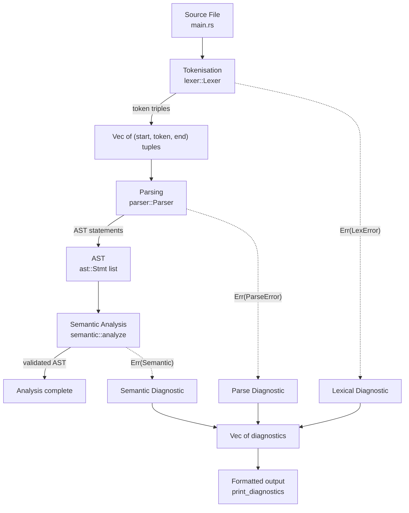
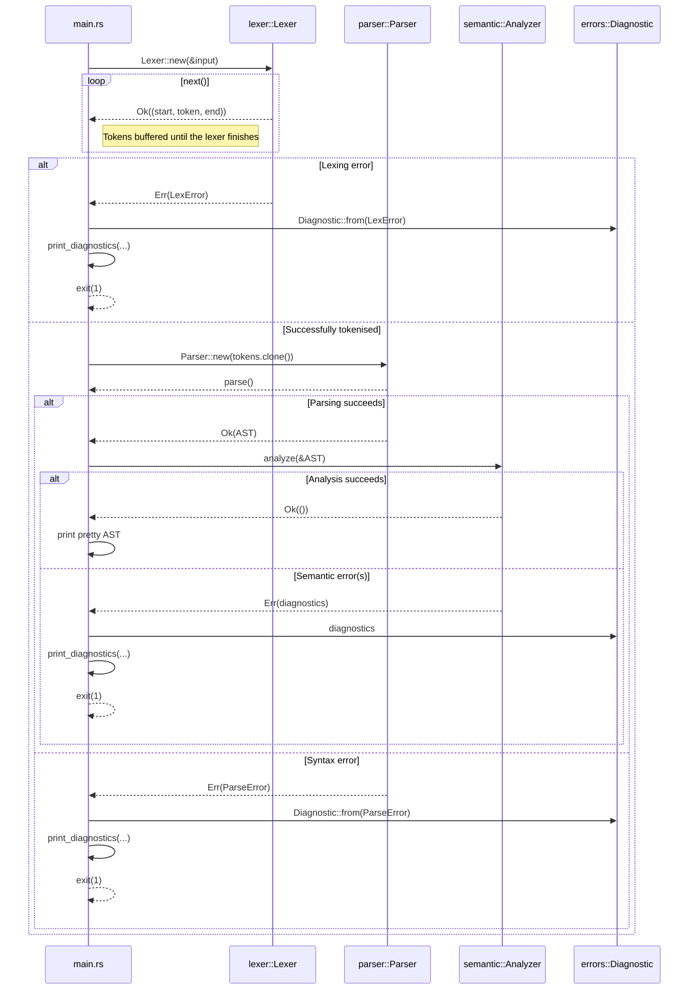
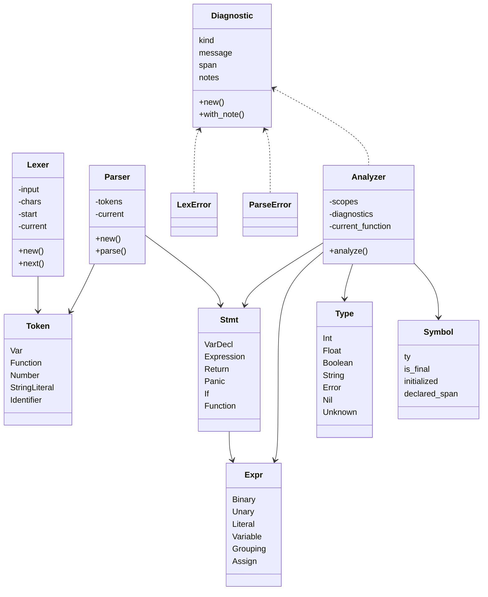
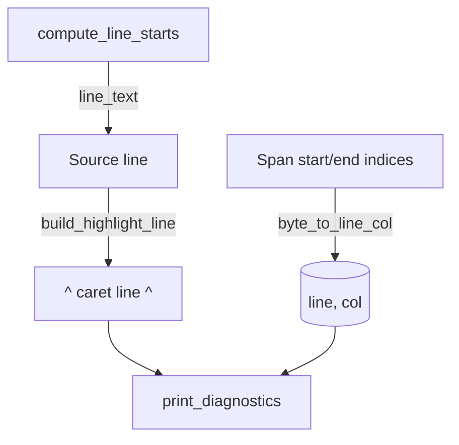
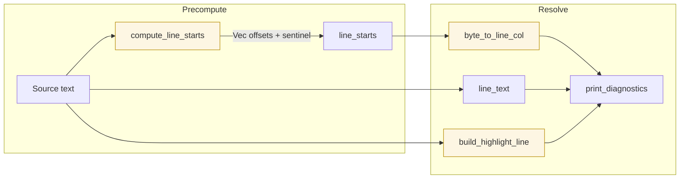

# Blazelint Pipeline Overview

## High-Level Data Flow

* `main.rs` coordinates the run: it loads the file, launches the lexer, hands the resulting tokens to the parser, and prints either the AST or any collected diagnostics.
* Once parsing succeeds, `semantic::analyze` walks the AST to enforce scope, type, and control-flow rules before printing the tree.
* Every stage is fallible. Errors stay rich with byte spans so the front-end can offer precise highlights.

## Runtime Interaction

The CLI intentionally clones the token list: one copy feeds the parser, the other is printed to help users debug lexer output.
The semantic analyzer only runs after the AST is produced successfully; if it finds mismatched types, undefined variables, or invalid returns, it emits diagnostics tagged as `DiagnosticKind::Semantic`.

## Structural Overview

## More details on modules

### `main.rs`
* Reads file paths from the CLI and loads the source into memory.
* Builds `line_starts` so byte spans can be mapped back to `(line, column)` pairs.
* Runs the lexer as an iterator, gathering either tokens or `LexError`s. All errors are converted into `Diagnostic` values immediately.
* Emits tokens for debugging before invoking the parser.
* Creates a `Parser`, calls `parse()`, then invokes `semantic::analyze` before printing the resulting `Vec<Stmt>` using Rust’s pretty debug formatter.
* On any diagnostic, calls `print_diagnostics`, which:
  * Maps byte spans to line/column positions.
  * Prints the offending line (with a caret underline built by `build_highlight_line`).
  * Appends any `note` entries supplied by the lexer or parser.

### `lexer.rs`
* `Lexer<'input>` holds the input string, a peekable iterator, and bookkeeping fields (`start`, `current`).
* Implements `Iterator`. Each call to `next()`:
  1. Skips whitespace and comments (`skip_whitespace_and_comments`), reporting unterminated block comments immediately.
  2. Marks the new `start` offset and advances over the next token.
  3. Delegates to helpers for strings, numbers, identifiers, or punctuation, returning `(start, token, end)` tuples.
  4. Emits `LexError` for malformed constructs (e.g., stray `&`, unterminated strings, malformed exponents).
* Keyword recognition happens in `identifier()`, which upgrades raw identifiers to reserved tokens (`Token::Function`, `Token::Return`, etc.).

### `parser.rs`
* `Parser` stores the token triplets and a cursor index.
* `parse()` repeatedly calls `declaration()` until `is_at_end()` finds no tokens left.
* `declaration()` dispatches on the next token: `var` declarations, `function` definitions, or generic statements.
* Statement parsing covers `if`/`else`, `return`, `panic`, and expression statements. Blocks recursively call `declaration()` until a matching `}` is consumed.
* Expression parsing follows classic recursive descent with precedence-climbing helpers (`logic_or`, `logic_and`, `equality`, `comparison`, `term`, `factor`, `unary`, `primary`).
* Assignment produces `Expr::Assign` nodes when the left-hand side is a plain identifier; otherwise it returns a `ParseError` with an expectation hint, which becomes a diagnostic note (`expected: identifier`).
* Errors such as missing semicolons or braces use `consume()` and the various `error_*` helpers to attach precise spans and expectations.

### `ast.rs`
* Defines the shape of the syntax tree that the parser builds.
* `Expr` variants cover literals, unary/binary operations, variables, assignments, and groupings.
* `Stmt` variants represent top-level constructs: variable declarations, expression statements, return/panic statements, `if` branches, and full function declarations.
* The AST is currently a light-weight data structure used primarily for debugging prints, but it establishes the schema for future linting passes.

### `errors.rs`
* Provides shared diagnostic types.
* `LexError` and `ParseError` carry messages plus the byte `Span` that triggered them (and optional expectation hints for the parser).
* `DiagnosticKind` distinguishes lexical, syntactic, and semantic issues so downstream tooling can attribute failures accurately.
* `Diagnostic::from(LexError)` and `Diagnostic::from(ParseError)` adapt stage-specific errors into the uniform reporting surface that `main.rs` prints. Semantic analysis constructs diagnostics directly using the same helpers.

### `semantic.rs`
* `analyze(&[Stmt])` is the public entry point invoked by `main.rs` after parsing succeeds.
* Maintains a stack of lexical scopes that map identifiers to `Symbol` records (type, mutability, initialisation state, and declaration span).
* Enforces typing rules for expressions (`check_expr`) and statements (`check_stmt`), ensuring assignments respect declared types, booleans guard branch conditions, and `return`/`panic` semantics align with function signatures.
* Tracks declared functions so mutual recursion checks can be added later, and records whether final variables are initialised exactly once.
* Emits semantic diagnostics with precise spans whenever scope or type rules are violated, allowing the CLI to surface them alongside lexer/parser errors.

## Diagnostics Rendering Details

* `compute_line_starts` emits a monotonically increasing list of byte offsets; a sentinel marks EOF so diagnostics on zero-width spans still map safely.
* `byte_to_line_col` walks that table to convert byte ranges into human-friendly coordinates.
* `line_text` and `build_highlight_line` extract the offending line and draw the caret marker, matching the behavior that the integration tests assert.

## Line & Column Tracking Internals

Blazelint keeps byte-based spans internally and converts them to human-friendly line/column locations only when printing diagnostics. The following helpers collaborate to make that happen:

| Function | Responsibility | Notes |
| --- | --- | --- |
| `compute_line_starts(source)` | Builds a vector of byte offsets for the beginning of every line **plus a sentinel** (the final `source.len()`). | The sentinel guarantees a safe upper bound for lookups, even for spans at EOF or zero-width spans. |
| `byte_to_line_col(line_starts, index)` | Walks the offsets to find the line window containing `index` and computes the 1-based column. | Uses `windows(2)` to examine each `[start, end)` range; falls back to the sentinel when the index sits at or beyond EOF. |
| `line_text(source, line_starts, line)` | Slices the original source to produce the full text of a specific line. | Trims trailing `\n`/`\r` so caret markers align predictably. |
| `build_highlight_line(source, span_start, span_end, line_start, line_end)` | Creates the visual `^^^^` underline that matches the span width. | Clamps to the line boundaries so multi-line spans still highlight their starting line cleanly. |
| `print_diagnostics(...)` | Ties everything together: converts spans to (line, col), prints the source line, and renders notes. | Delegates column math to the helpers above and formats the final output. |

