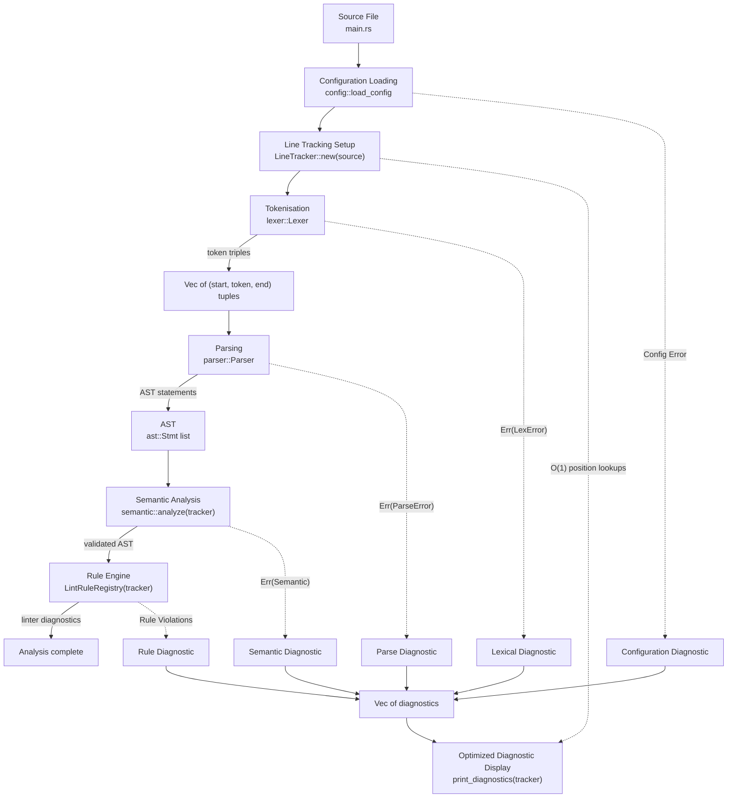
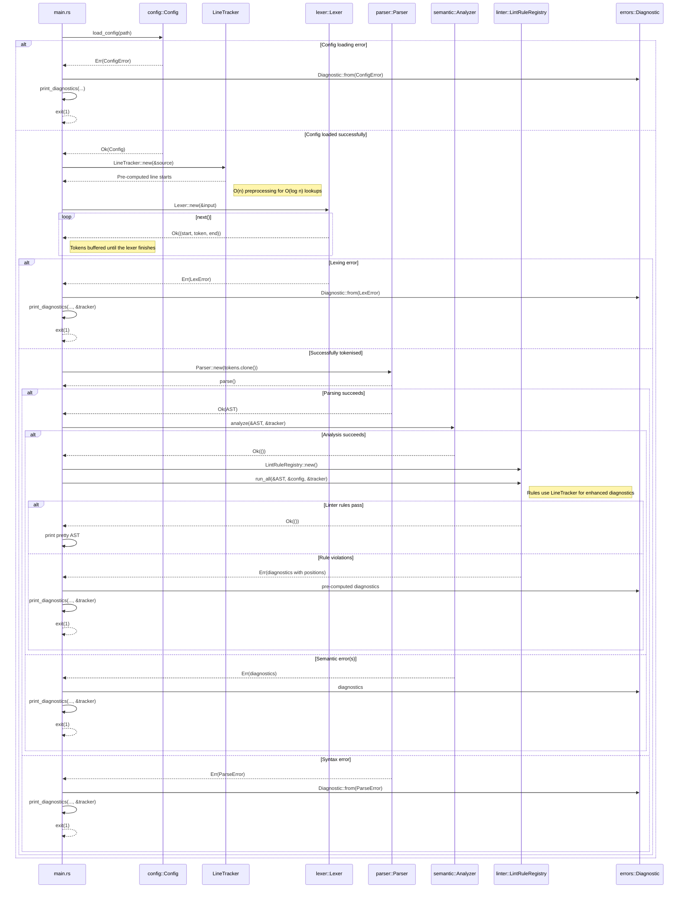
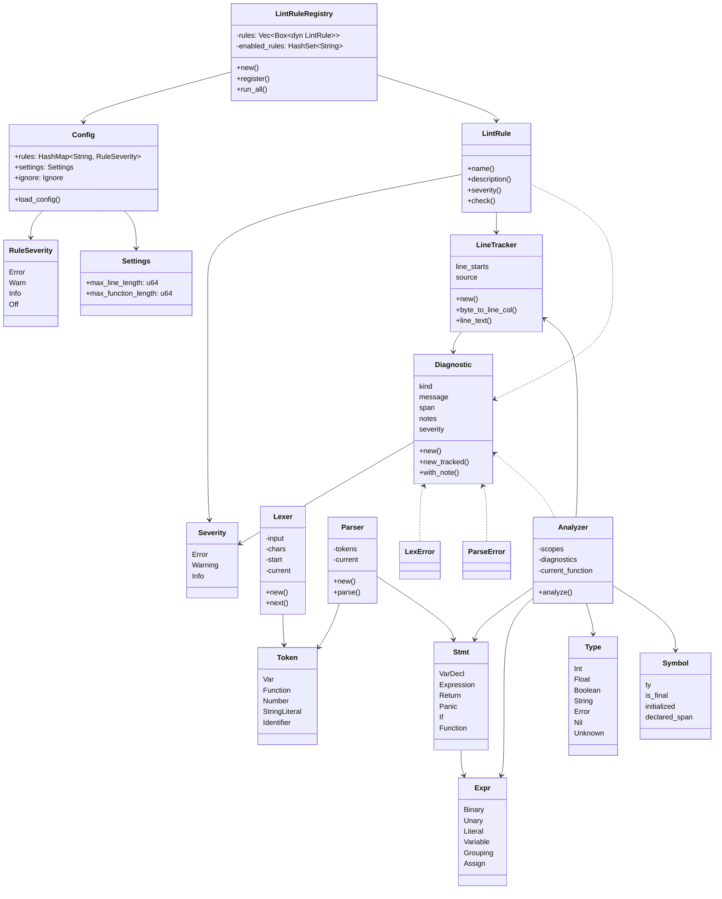
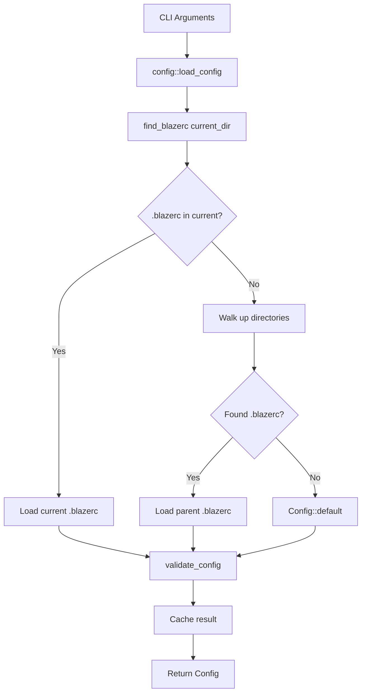
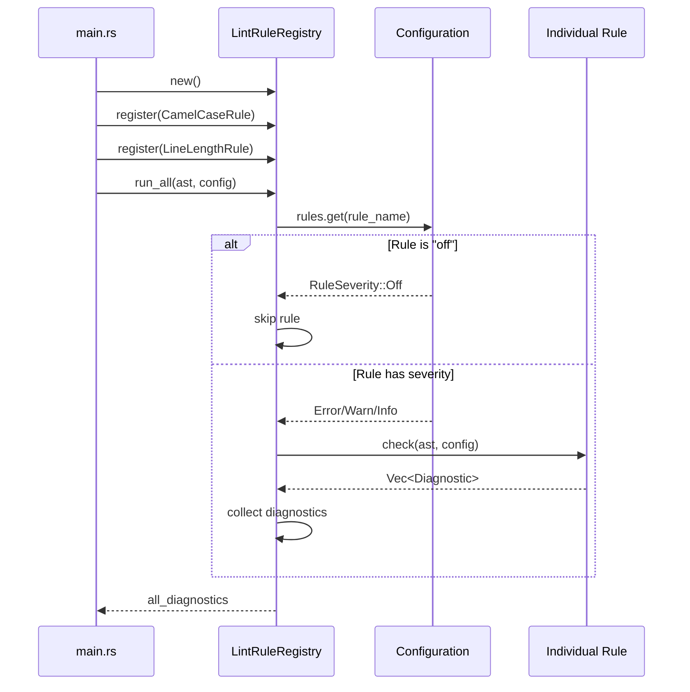
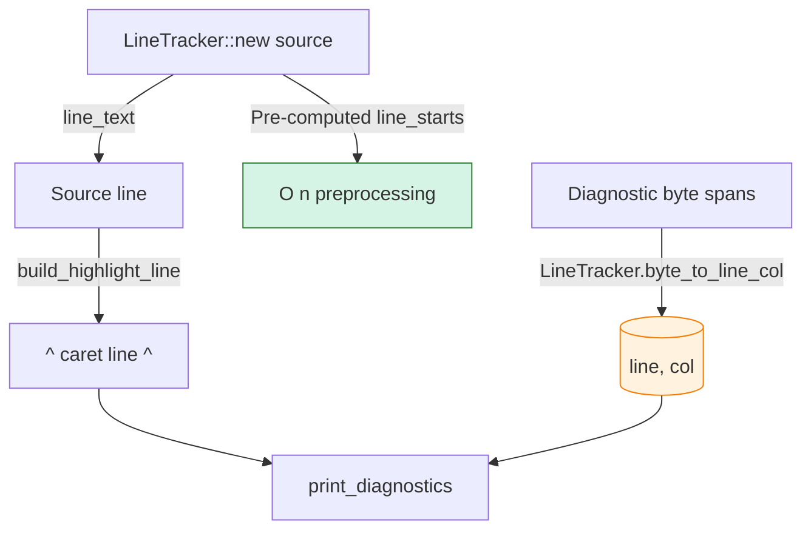
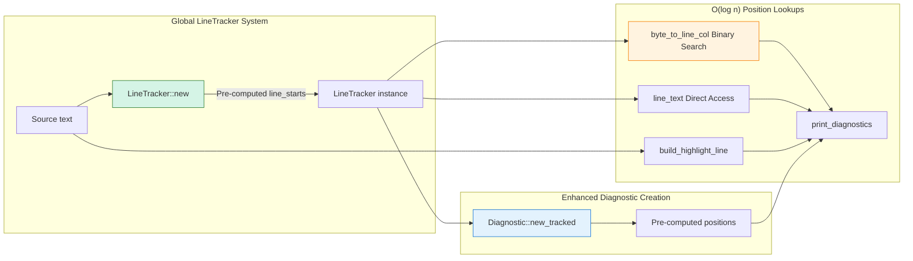
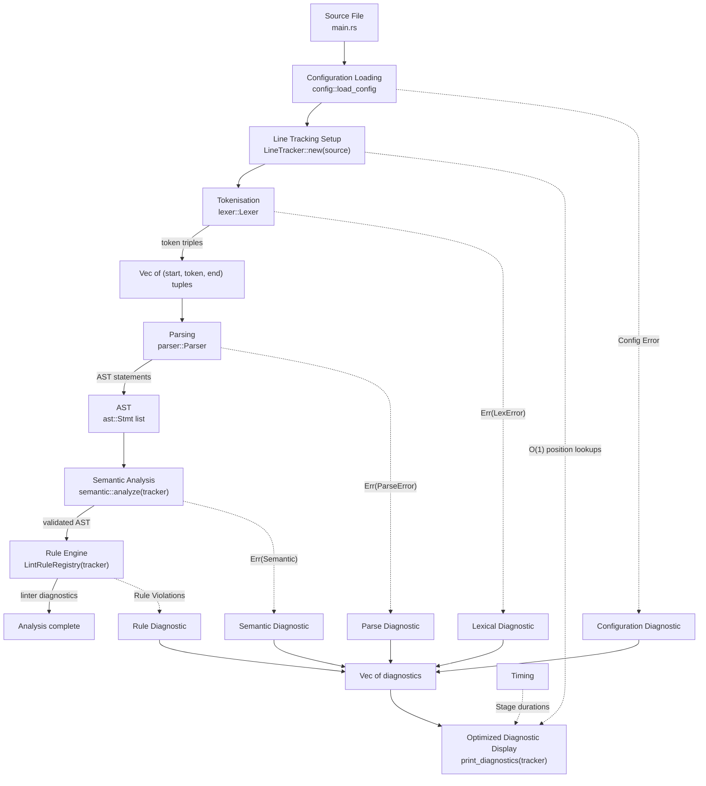

# Blazelint Pipeline Overview

## High-Level Data Flow


```mermaid
flowchart TD
    Source["Source File\nmain.rs"] --> Config["Configuration Loading\nconfig::load_config"]
    Config --> LineTracker["Line Tracking Setup\nLineTracker::new(source)"]
    LineTracker --> Lex["Tokenisation\nlexer::Lexer"]
    Lex -->|token triples| TokenStream["Vec of (start, token, end) tuples"]
    TokenStream --> Parse["Parsing\nparser::Parser"]
    Parse -->|AST statements| Ast["AST\nast::Stmt list"]
    Ast --> Sem["Semantic Analysis\nsemantic::analyze(tracker)"]
    Sem -->|validated AST| Rules["Rule Engine\nLintRuleRegistry(tracker)"]
    Rules -->|linter diagnostics| Ready["Analysis complete"]

    Config -. Config Error .-> ConfigDiag[Configuration Diagnostic]
    Lex -. Err(LexError) .-> LexDiag[Lexical Diagnostic]
    Parse -. Err(ParseError) .-> ParseDiag[Parse Diagnostic]
    Sem -. Err(Semantic) .-> SemDiag[Semantic Diagnostic]
    Rules -. Rule Violations .-> RuleDiag[Rule Diagnostic]

    ConfigDiag --> Collect["Vec of diagnostics"]
    LexDiag --> Collect
    ParseDiag --> Collect
    SemDiag --> Collect
    RuleDiag --> Collect
    Collect --> Render["Optimized Diagnostic Display\nprint_diagnostics(tracker)"]

    LineTracker -.->|"O(1) position lookups"| Render
```

* `main.rs` coordinates the run: it loads configuration, creates a global line tracker, and processes the file through the lexer, parser, semantic analyzer, and rule engine.
* **Configuration loading** happens first, determining which rules to apply and their settings.
* **Line tracking setup** creates a `LineTracker` instance for efficient O(log n) position mapping throughout the pipeline.
* **Rule engine** applies configured linter rules with appropriate severity levels and pre-computed diagnostic positions.
* Every stage is fallible. Errors stay rich with byte spans, and the LineTracker provides fast position resolution for precise highlights.

## Runtime Interaction


```mermaid
sequenceDiagram
    participant CLI as main.rs
    participant Config as config::Config
    participant Tracker as LineTracker
    participant Lex as lexer::Lexer
    participant Parse as parser::Parser
    participant Sem as semantic::Analyzer
    participant Rules as linter::LintRuleRegistry
    participant Diag as errors::Diagnostic

    CLI->>Config: load_config(path)
    alt Config loading error
        Config-->>CLI: Err(ConfigError)
        CLI->>Diag: Diagnostic::from(ConfigError)
        CLI->>CLI: print_diagnostics(...)
        CLI-->>CLI: exit(1)
    else Config loaded successfully
        Config-->>CLI: Ok(Config)
        CLI->>Tracker: LineTracker::new(&source)
        Tracker-->>CLI: Pre-computed line starts
        note right of Tracker: O(n) preprocessing for O(log n) lookups
        CLI->>Lex: Lexer::new(&input)
        loop next()
            Lex-->>CLI: Ok((start, token, end))
            note right of CLI: Tokens buffered until the lexer finishes
        end
        alt Lexing error
            Lex-->>CLI: Err(LexError)
            CLI->>Diag: Diagnostic::from(LexError)
            CLI->>CLI: print_diagnostics(..., &tracker)
            CLI-->>CLI: exit(1)
        else Successfully tokenised
            CLI->>Parse: Parser::new(tokens.clone())
            Parse-->>CLI: parse()
            alt Parsing succeeds
                Parse-->>CLI: Ok(AST)
                CLI->>Sem: analyze(&AST, &tracker)
                alt Analysis succeeds
                    Sem-->>CLI: Ok(())
                    CLI->>Rules: LintRuleRegistry::new()
                    CLI->>Rules: run_all(&AST, &config, &tracker)
                    note right of Rules: Rules use LineTracker for enhanced diagnostics
                    alt Linter rules pass
                        Rules-->>CLI: Ok(())
                        CLI->>CLI: print pretty AST
                    else Rule violations
                        Rules-->>CLI: Err(diagnostics with positions)
                        CLI->>Diag: pre-computed diagnostics
                        CLI->>CLI: print_diagnostics(..., &tracker)
                        CLI-->>CLI: exit(1)
                    end
                else Semantic error(s)
                    Sem-->>CLI: Err(diagnostics)
                    CLI->>Diag: diagnostics
                    CLI->>CLI: print_diagnostics(..., &tracker)
                    CLI-->>CLI: exit(1)
                end
            else Syntax error
                Parse-->>CLI: Err(ParseError)
                CLI->>Diag: Diagnostic::from(ParseError)
                CLI->>CLI: print_diagnostics(..., &tracker)
                CLI-->>CLI: exit(1)
            end
        end
    end
```

The pipeline includes:
- **Configuration loading** as the first step, which can fail independently
- **Rule engine** as a separate stage after semantic analysis
- **Configurable rule execution** based on loaded configuration
- **Severity-based diagnostic output** from rules

The CLI intentionally clones the token list: one copy feeds the parser, the other is printed to help users debug lexer output.
The semantic analyzer only runs after the AST is produced successfully; if it finds mismatched types, undefined variables, or invalid returns, it emits diagnostics tagged as `DiagnosticKind::Semantic`.

## Structural Overview


```mermaid
classDiagram
    direction TB

    class Config {
        +load_config()
        +rules: HashMap~String, RuleSeverity~
        +settings: Settings
        +ignore: Ignore
    }

    class RuleSeverity {
        Error
        Warn
        Info
        Off
    }

    class Settings {
        +max_line_length: u64
        +max_function_length: u64
    }

    class LintRuleRegistry {
        +new()
        +register()
        +run_all()
        -rules: Vec~Box~dyn LintRule~~
        -enabled_rules: HashSet~String~
    }

    class LintRule {
        +name()
        +description()  
        +severity()
        +check()
    }

    class Severity {
        Error
        Warning  
        Info
    }

    class Lexer {
        +new()
        +next()
        -input
        -chars
        -start
        -current
    }

    class Token {
        Var
        Function
        Number
        StringLiteral
        Identifier
    }

    class Parser {
        +new()
        +parse()
        -tokens
        -current
    }

    class Analyzer {
        +analyze()
        -scopes
        -diagnostics
        -current_function
    }

    class Type {
        Int
        Float
        Boolean
        String
        Error
        Nil
        Unknown
    }

    class Symbol {
        ty
        is_final
        initialized
        declared_span
    }

    class Stmt {
        VarDecl
        Expression
        Return
        Panic
        If
        Function
    }

    class Expr {
        Binary
        Unary
        Literal
        Variable
        Grouping
        Assign
    }

    class LineTracker {
        +new()
        +byte_to_line_col()
        +line_text()
        line_starts
        source
    }

    class Diagnostic {
        +new()
        +new_tracked()
        +with_note()
        kind
        message
        span
        notes
        severity
    }

    Config --> RuleSeverity
    Config --> Settings
    LintRuleRegistry --> Config
    LintRuleRegistry --> LintRule
    LintRule --> Severity
    Lexer --> Token
    Parser --> Token
    Parser --> Stmt
    Stmt --> Expr
    Analyzer --> Stmt
    Analyzer --> Expr
    Analyzer --> Type
    Analyzer --> Symbol
    Diagnostic --> Severity
    LineTracker --> Diagnostic
    Diagnostic <.. LexError
    Diagnostic <.. ParseError
    Diagnostic <.. Analyzer
    Diagnostic <.. LintRule
    Analyzer --> LineTracker
    LintRule --> LineTracker
```

## More details on modules

### `main.rs` (Entry Point)
* **Configuration Loading**: First loads `.blazerc` or uses defaults
* **CLI Processing**: Reads file paths from command-line arguments  
* **Pipeline Orchestration**: Coordinates config → LineTracker → lexer → parser → semantic → rules
* **LineTracker Initialization**: Creates global LineTracker for O(log n) position lookups
* **Error Handling**: Converts all error types to unified `Diagnostic` format with enhanced positioning
* **Rule Engine Integration**: Passes configuration and LineTracker to rule engine for execution

### `config.rs` (Configuration System)
* **Configuration Loading**: Handles TOML file parsing and validation
* **Rule Configuration**: Manages per-rule settings (enabled/disabled, severity, options)
* **Default Configurations**: Provides built-in defaults when no config file exists
* **Configuration Validation**: Ensures rule configurations are valid
* **Configuration Discovery**: Walks directory tree to find `.blazerc` files
* **Caching**: Static caching for performance optimization

### `linter/registry.rs` (Rule Engine)
* **LintRuleRegistry**: Coordinates rule execution based on configuration
* **Rule Management**: Dynamic rule loading and registration
* **LintRule Trait**: Standard interface with LineTracker support for enhanced diagnostics
* **Severity Handling**: Rules emit diagnostics with configured severity levels and pre-computed positions
* **Configuration Integration**: Each rule receives configuration and LineTracker for optimized position tracking
* **Performance**: O(log n) diagnostic creation via LineTracker vs previous O(n) per-diagnostic calculations

### `lexer.rs`
* `Lexer<'input>` holds the input string, a peekable iterator, and bookkeeping fields (`start`, `current`).
* Implements `Iterator`. Each call to `next()`:
  1. Skips whitespace and comments (`skip_whitespace_and_comments`), reporting unterminated block comments immediately.
  2. Marks the new `start` offset and advances over the next token.
  3. Delegates to helpers for strings, numbers, identifiers, or punctuation, returning `(start, token, end)` tuples.
  4. Emits `LexError` for malformed constructs (e.g., stray `&`, unterminated strings, malformed exponents).
* Keyword recognition happens in `identifier()`, which upgrades raw identifiers to reserved tokens (`Token::Function`, `Token::Return`, etc.).


### `parser.rs`
* `Parser` stores the token triplets and a cursor index.
* `parse()` repeatedly calls `declaration()` until `is_at_end()` finds no tokens left.
* `declaration()` dispatches on the next token: `var` declarations, `function` definitions, or generic statements.
* Statement parsing covers `if`/`else`, `return`, `panic`, and expression statements. Blocks recursively call `declaration()` until a matching `}` is consumed.
* Expression parsing follows classic recursive descent with precedence-climbing helpers (`logic_or`, `logic_and`, `equality`, `comparison`, `term`, `factor`, `unary`, `primary`).
* Assignment produces `Expr::Assign` nodes when the left-hand side is a plain identifier; otherwise it returns a `ParseError` with an expectation hint, which becomes a diagnostic note (`expected: identifier`).
* Errors such as missing semicolons or braces use `consume()` and the various `error_*` helpers to attach precise spans and expectations.

### `ast.rs`
* Defines the shape of the syntax tree that the parser builds.
* `Expr` variants cover literals, unary/binary operations, variables, assignments, and groupings.
* `Stmt` variants represent top-level constructs: variable declarations, expression statements, return/panic statements, `if` branches, and full function declarations.
* The AST is currently a light-weight data structure used primarily for debugging prints, but it establishes the schema for future linting passes.

### `errors.rs`
* Provides shared diagnostic types.
* `LexError` and `ParseError` carry messages plus the byte `Span` that triggered them (and optional expectation hints for the parser).
* `DiagnosticKind` distinguishes lexical, syntactic, semantic, and linter issues so downstream tooling can attribute failures accurately.
* `Severity` enum provides Error, Warning, and Info levels for diagnostic categorization.
* **Enhanced Diagnostics**: Added `Diagnostic::new_tracked()` method for O(log n) position computation using LineTracker.

### `utils.rs` (LineTracker System)
* **LineTracker**: Global line tracking system for efficient position lookups throughout the pipeline
* **Pre-computation**: `LineTracker::new(source)` processes source once to build line_starts vector with O(n) preprocessing
* **Position Resolution**: `byte_to_line_col(byte_pos)` uses binary search for O(log n) line/column lookups vs previous O(n) calculations
* **Line Access**: `line_text(line)` provides direct access to source lines for diagnostic rendering
* **Performance Benefits**: Reduces diagnostic position computation from O(n * d) to O(n + d * log n) where d = number of diagnostics
* **Memory Efficiency**: Single line_starts vector shared across all pipeline stages and diagnostic creation

## Configuration System Details

### Configuration File Format

The `.blazerc` file uses TOML format with three main sections:

```toml
[rules]
# Rule severity configuration
camel-case = "error"        # error, warn, info, off
constant-case = "warn"
line-length = "warn"

[settings]  
# Rule-specific parameters
max-line-length = 120
max-function-length = 50

[ignore]
# File patterns to ignore (future feature)
patterns = ["vendor/**", "*.generated.bal"]
```

### Configuration Loading Flow


```mermaid
flowchart TD
    Start[CLI Arguments] --> LoadConfig[config::load_config]
    LoadConfig --> FindBlaze[find_blazerc current_dir]
    
    FindBlaze --> CurrentExists{.blazerc in current?}
    CurrentExists -->|Yes| LoadCurrent[Load current .blazerc]
    CurrentExists -->|No| WalkUp[Walk up directories]
    
    WalkUp --> ParentExists{Found .blazerc?}
    ParentExists -->|Yes| LoadParent[Load parent .blazerc]
    ParentExists -->|No| UseDefault[Config::default]
    
    LoadCurrent --> ValidateConfig[validate_config]
    LoadParent --> ValidateConfig
    UseDefault --> ValidateConfig
    
    ValidateConfig --> CacheResult[Cache result]
    CacheResult --> ReturnConfig[Return Config]
```

### Rule Engine Architecture


```mermaid
sequenceDiagram
    participant Main as main.rs
    participant Registry as LintRuleRegistry
    participant Config as Configuration
    participant Rule as Individual Rule

    Main->>Registry: new()
    Main->>Registry: register(CamelCaseRule)
    Main->>Registry: register(LineLengthRule)
    Main->>Registry: run_all(ast, config)
    
    Registry->>Config: rules.get(rule_name)
    alt Rule is "off"
        Config-->>Registry: RuleSeverity::Off
        Registry->>Registry: skip rule
    else Rule has severity
        Config-->>Registry: Error/Warn/Info
        Registry->>Rule: check(ast, config)
        Rule-->>Registry: Vec<Diagnostic>
        Registry->>Registry: collect diagnostics
    end
    
    Registry-->>Main: all_diagnostics
```

### Enhanced Rule Structure

```rust
pub trait LintRule: Send + Sync {
    fn name(&self) -> &'static str;
    fn description(&self) -> &'static str;
    fn severity(&self, config: &Config) -> Severity;
    fn check(&self, ast: &[Stmt], file_path: &str, source: &str, config: &Config) -> Vec<Diagnostic>;
}
```

### Performance Optimizations

- **Configuration Caching**: Uses `once_cell::sync::Lazy` and `Mutex<HashMap>` for path-based caching
- **Rule Registry**: Only enabled rules are executed, skipping disabled ones early
- **Diagnostic Collection**: Pre-allocated vectors minimize heap allocations
- **Severity Mapping**: Efficient `From<RuleSeverity>` trait implementation

---

**Pipeline Evolution**: The pipeline has evolved from a simple 3-stage process (lex → parse → semantic) to a 5-stage configurable system (config → **LineTracker** → lex → parse → semantic → rules) with enhanced error handling, rule management, user customization capabilities, and **optimized O(log n) diagnostic positioning**. The addition of global line tracking represents a significant performance improvement, reducing diagnostic position computation complexity from O(n) per diagnostic to O(log n) through pre-computed line starts and binary search algorithms.
* `Diagnostic::from(LexError)` and `Diagnostic::from(ParseError)` adapt stage-specific errors into the uniform reporting surface that `main.rs` prints. Semantic analysis constructs diagnostics directly using the same helpers.

### `semantic.rs`
* `analyze(&[Stmt], &LineTracker)` is the public entry point invoked by `main.rs` after parsing succeeds.
* Maintains a stack of lexical scopes that map identifiers to `Symbol` records (type, mutability, initialisation state, and declaration span).
* Enforces typing rules for expressions (`check_expr`) and statements (`check_stmt`), ensuring assignments respect declared types, booleans guard branch conditions, and `return`/`panic` semantics align with function signatures.
* Tracks declared functions so mutual recursion checks can be added later, and records whether final variables are initialised exactly once.
* **Enhanced Diagnostics**: Uses `Diagnostic::new_tracked()` with LineTracker for O(log n) position resolution instead of O(n) per-diagnostic calculations.
* Emits semantic diagnostics with pre-computed line/column positions whenever scope or type rules are violated, enabling efficient CLI rendering.

## Diagnostics Rendering Details


```mermaid
graph TD
    LineTracker[LineTracker::new source]
    span[Diagnostic byte spans]
    LineTracker -->|Pre-computed line_starts| PreProcess[O n preprocessing]
    span -->|LineTracker.byte_to_line_col| lineCol[(line, col)]
    LineTracker -->|line_text| lineText[Source line]
    lineText -->|build_highlight_line| underline[^ caret line ^]
    underline --> Display[print_diagnostics]
    lineCol --> Display
    
    style PreProcess fill:#d5f4e6,stroke:#2d7d32
    style lineCol fill:#fff3e0,stroke:#f57c00
```

* **Global LineTracker**: Pre-computes line starts once during pipeline initialization for O(log n) position lookups
* `LineTracker::new(source)` creates the line starts vector with sentinel for safe EOF handling
* `byte_to_line_col` uses binary search on pre-computed line starts for efficient position resolution
* `line_text` and `build_highlight_line` extract offending lines and draw caret markers using the LineTracker
* **Performance**: O(n) preprocessing enables O(log n) diagnostic position resolution vs previous O(n) per-diagnostic

## Line & Column Tracking Internals

Blazelint now uses a global `LineTracker` system that pre-computes line positions once and provides efficient O(log n) lookups throughout the pipeline:

| Function | Responsibility | Performance | Notes |
| --- | --- | --- | --- |
| `LineTracker::new(source)` | Builds line_starts vector with byte offsets for every line plus sentinel | O(n) | One-time preprocessing during pipeline initialization |
| `LineTracker::byte_to_line_col(byte_pos)` | Binary search on pre-computed line_starts for position resolution | O(log n) | Previously O(n) per diagnostic, now optimized |
| `LineTracker::line_text(line)` | Slices source to produce full text of specific line | O(1) | Trims trailing `\n`/`\r` for consistent caret alignment |
| `build_highlight_line(...)` | Creates visual `^^^^` underline matching span width | O(k) | Clamps to line boundaries for clean multi-line spans |
| `print_diagnostics(tracker, ...)` | Unified diagnostic rendering using LineTracker for all position data | O(log n) per diagnostic | Enhanced with pre-computed position lookups |
| `Diagnostic::new_tracked(...)` | Creates diagnostics with pre-computed line/column from LineTracker | O(log n) | Preferred method for rules and semantic analysis |


```mermaid
flowchart LR
        subgraph "Global LineTracker System"
            A[Source text] --> B[LineTracker::new]
            B -->|Pre-computed line_starts| C[LineTracker instance]
        end

        subgraph "O(log n) Position Lookups"
            C --> D[byte_to_line_col Binary Search]
            C --> E[line_text Direct Access]
            A --> F[build_highlight_line]
            D --> G[print_diagnostics]
            E --> G
            F --> G
        end

        subgraph "Enhanced Diagnostic Creation"
            C --> H[Diagnostic::new_tracked]
            H --> I[Pre-computed positions]
            I --> G
        end

        style B fill:#d5f4e6,stroke:#2d7d32
        style D fill:#fff3e0,stroke:#f57c00
        style H fill:#e3f2fd,stroke:#1976d2
```

## Updates in v0.3.0

### Timing Instrumentation
- Added `--timing` and `--detailed-timing` flags to measure and display performance metrics for each pipeline stage.
- Timing data is integrated into the diagnostics pipeline, providing insights into lexing, parsing, semantic analysis, and linting durations.

### Workflow Enhancements
- Enforced deterministic builds using `--locked` to ensure reproducibility.
- Automated tag-driven releases with preflight checks for formatting, linting, and tests.
- Added checksum verification for release artifacts.

### Enhanced Diagnostics
- Global line tracking system ensures precise error reporting with O(log n) position lookups.
- Diagnostics now include detailed timing information when `--detailed-timing` is enabled.

### Updated Pipeline Diagram


```mermaid
flowchart TD
    Source["Source File\nmain.rs"] --> Config["Configuration Loading\nconfig::load_config"]
    Config --> LineTracker["Line Tracking Setup\nLineTracker::new(source)"]
    LineTracker --> Lex["Tokenisation\nlexer::Lexer"]
    Lex -->|token triples| TokenStream["Vec of (start, token, end) tuples"]
    TokenStream --> Parse["Parsing\nparser::Parser"]
    Parse -->|AST statements| Ast["AST\nast::Stmt list"]
    Ast --> Sem["Semantic Analysis\nsemantic::analyze(tracker)"]
    Sem -->|validated AST| Rules["Rule Engine\nLintRuleRegistry(tracker)"]
    Rules -->|linter diagnostics| Ready["Analysis complete"]

    Config -. Config Error .-> ConfigDiag[Configuration Diagnostic]
    Lex -. Err(LexError) .-> LexDiag[Lexical Diagnostic]
    Parse -. Err(ParseError) .-> ParseDiag[Parse Diagnostic]
    Sem -. Err(Semantic) .-> SemDiag[Semantic Diagnostic]
    Rules -. Rule Violations .-> RuleDiag[Rule Diagnostic]

    ConfigDiag --> Collect["Vec of diagnostics"]
    LexDiag --> Collect
    ParseDiag --> Collect
    SemDiag --> Collect
    RuleDiag --> Collect
    Collect --> Render["Optimized Diagnostic Display\nprint_diagnostics(tracker)"]

    LineTracker -.->|"O(1) position lookups"| Render
    Timing -.->|"Stage durations"| Render
```

* Added timing instrumentation to the pipeline for detailed performance insights.
* Updated workflow to ensure reproducibility and automation.
