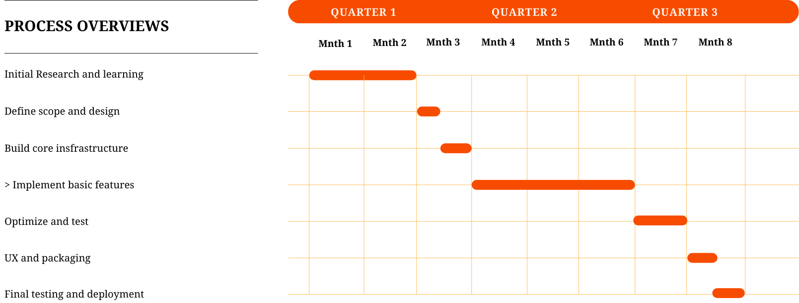

<div align="center">

## BlazeLint
# **Software Requirements Specification**

v1.0.0 | 22.04.2025<br>
**Authors** : M. C. R. Mallawaarachchi, R. K. N. R. Ranasinghe, G. K. S. Pathum <br>
</div>

## 1. Introduction

### 1.1 Product Scope
This project aims to develop a modular, extensible, and pluggable code linter for the **Ballerina** programming language, written in **Rust**. It focuses on performance, memory safety, and flexibility, using a rule-based architecture to detect syntax issues, bad practices, and code style violations.

### 1.2 Product Value
- Fast, safe, and cross-platform linter
- Easily integrated into CI pipelines or development workflows
- Extensible with user-defined rules
- Promotes consistent and error-free code

### 1.3 Intended Audience

The following user types are expected to interact with this tool:

| User Class | Description | Technical Skill Level | Responsibilities/Goals |
|------------|-------------|-----------------------|------------------------|
| Developer (Beginner) | Users who are new to programming or unfamiliar with best practices | Low to Medium | Use the linter to catch basic syntax issues and improve coding standards |
| Developer (Advanced) | Experienced programmers or contributors | High | Customize linter rules, contribute new rules, and configure advanced settings or create plugins |
| DevOps/CI Engineers  | Developers integrating tools into CI/CD pipelines  | Medium to High | Run linter automatically during builds to enforce code quality |
| Project Maintainers  | People responsible for overall code quality in a team or open-source repo  | High | Use diagnostics to maintain standards, review reports, and configure project settings |

### 1.4 Intended Use
- As a CLI tool during development
- In CI/CD pipelines for automated code checks
- As a library integrated into Rust-based tools or IDE extensions

### 1.5 General Description
The linter tokenizes Ballerina code and applies a set of linting rules to detect violations. The system is written in Rust and offers both a CLI interface and a pluggable architecture for extensibility.

---

## 2. Functional Requirements

### 2.1 Lexical Analysis (Preprocessing)
- Tokenizes source code as a preliminary step, if needed for the parser.
- May be maintained for debugging or token-level fallback rules.

### 2.2 Parsing & AST Construction
- Parses the tokenized source code to construct an **Abstract Syntax Tree (AST)**.
- Provides a hierarchical structure that represents the code, capturing nested scopes and syntax elements.

### 2.3 Rule Engine
- Applies linting rules directly to the **AST** nodes rather than on a flat token stream.
- Enables context-aware analysis such as detecting misplaced imports or function declaration issues.

### 2.4 Diagnostics Reporting
- Outputs warnings and errors in a human-readable format or as structured data (e.g., JSON).
- Includes relevant information like error messages, and line and column numbers from the AST.

### 2.5 Configuration System
- Loads rule configurations from a config file or defaults if none is provided.
- Allows enabling/disabling of specific AST-based rules.

### 2.6 CLI Interface
- Parses command-line arguments and flags:
  - `--help`
  - `--version`
  - `--config`
  - `--verbose`

---

## 3. External Interface Requirements

### 3.1 User Interface Requirements
- CLI-based interaction
- Supports both standard output and machine-readable JSON
- Flags:
  - `--help (-h)`
  - `--version (-v)`
  - `--config (-c)`
  - `--verbose (-vb)`

### 3.2 Hardware Interface Requirements
- No special hardware dependencies

### 3.3 Software Interface Requirements
- Accepts UTF-8 encoded source files

### 3.4 Communication Interface Requirements
- No external communication (offline tool)

---

## 4. Non-Functional Requirements

### 4.1 Security
- Memory-safe by design (Rust)
- No file writes or remote calls

### 4.2 Capacity
- Efficient memory usage; capable of linting large files

### 4.3 Compatibility
- Compatible with Linux, macOS, and Windows operating system environments

### 4.4 Reliability
- Handles invalid input gracefully
- Fails with helpful messages

### 4.5 Scalability
- Designed to support future rule sets and features with minimal refactor

### 4.6 Maintainability
- Modular codebase
- Rules implemented via trait objects

### 4.7 Usability
- Clear CLI UX with meaningful messages and config options with appropriate colors

### 4.8 Other Non-Functional Requirements
- Fast execution (faster than any linter tools written in interpreted languages)

---

## 5. Definitions and Acronyms

| Term       | Definition                                                                                   |
|------------|----------------------------------------------------------------------------------------------|
| AST        | Abstract Syntax Tree ( A tree like representation of the structure of a programming language)|
| Token      | A unit of code (keyword, symbol, identifier, etc.)                                           |
| Lexer      | A function that can tokenize (split into tokens) a given string                              |
| Diagnostic | A warning or error reported by a rule                                                        |
| Rule       | A module that checks specific patterns or errors in the code                                 |

---

## 6. Preliminary Schedule



---

## 7. Appendices

Sample config file (`config.toml`):

```toml
# Linter Configuration example
[rules]
unknown-token = true
function-declaration = true
import-statement = true
```

